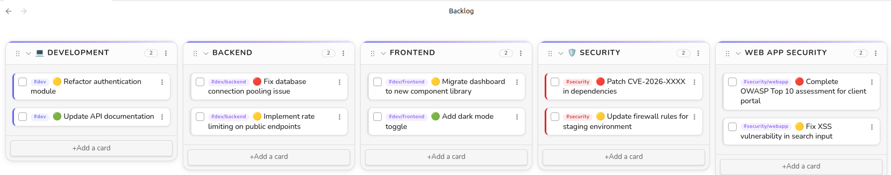
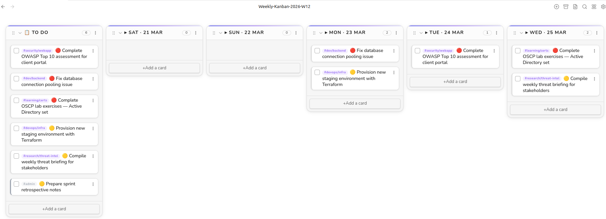

# Obsidian Kanban Weekly Planner

A lightweight planning vault for [Obsidian](https://obsidian.md) built around two core artifacts:

- a permanent project backlog
- a weekly Kanban board generated from a template

The repository is designed for users who want a simple planning system inside Obsidian without depending on an external task manager. It supports both English and Arabic weekly boards, including right-to-left rendering for Arabic.



## Overview

The workflow is intentionally simple:

1. Capture and organize work in `Backlog.md`
2. Create a weekly board from the template
3. Choose the board language when the template runs
4. Drag selected tasks into the current week
5. Move tasks through the board during the week

The vault is optimized for planning clarity rather than automation complexity. Metadata stays machine-friendly, while visible labels are localized for the chosen board language.

## Features

- Permanent backlog board for long-lived task capture and project planning
- Weekly board template powered by Templater
- Language prompt on board creation: English or Arabic
- Exact filename rules:
  - English weekly boards: `YYYY-Www.md`
  - Arabic weekly boards: `YYYY-Www-ar.md`
- Collision protection: if a board for the same week and language already exists, template creation stops with an explicit error
- ISO-style metadata in frontmatter for consistency:
  - `week`
  - `date_start`
  - `date_end`
  - `locale`
  - `cssclasses`
- Arabic support as a first-class feature:
  - Arabic lane labels
  - Arabic weekday and month names
  - right-to-left board rendering
  - Arabic-capable font stack
- Starter backlog designed for first-time setup:
  - `Inbox`
  - `Project 1`
  - `Project 2`
  - `Project 3`
- Separate English and Arabic example boards for onboarding
- Example project-specific tags and colors for easy customization
- Priority markers in task text:
  - `🔴` High
  - `🟡` Medium
  - `🟢` Low
- Custom CSS snippet for board styling

## Arabic Support

Arabic support is built into the same planner system rather than maintained as a separate template.

When the weekly template runs and Arabic is selected:

- the note is created with an `-ar` filename suffix
- the board uses Arabic day and month names
- lane labels are localized
- the note receives RTL-specific CSS classes
- the board layout renders right-to-left through the CSS snippet

This keeps the underlying structure consistent while making the Arabic experience usable as a native planning mode, not just translated text inside an English layout.

## Prerequisites

Install [Obsidian](https://obsidian.md) v1.5 or later, then install and enable these community plugins:

| Plugin | Purpose |
|--------|---------|
| [Templater](https://github.com/SilentVoid13/Templater) | Generates, renames, and localizes weekly boards |
| [Kanban](https://github.com/mgmeyers/obsidian-kanban) | Renders Markdown-backed Kanban boards |

The committed vault also includes `Calendar` and `Dataview` as optional extras inside `.obsidian`, but the planner itself depends only on Templater and Kanban.

## Quick Start

1. Clone or download the repository.
2. Open the folder as an Obsidian vault.
3. Set `Settings -> Templater -> Template folder location` to `_templates`.
4. Enable the `kanban-professional` CSS snippet in `Settings -> Appearance -> CSS snippets`.
5. Open `Backlog.md`.
6. Rename `Project 1`, `Project 2`, and `Project 3` to match your real projects.
7. Add tasks under the appropriate project lane. Use `Inbox` for unsorted tasks.
8. Optionally review `Backlog-Example.md`, `Backlog-Example-ar.md`, `2026-W01.md`, and `2026-W01-ar.md` for reference.
9. Run `Templater: Create new note from template`.
10. Select `Weekly-Kanban-Template`.
11. Choose the board language.
12. Drag tasks from `Backlog.md` into the new weekly board.

## Weekly Workflow

### 1. Plan the week

- Create the weekly board from the template
- Choose English or Arabic
- Move committed work from the backlog into the weekly board

### 2. Schedule daily work

- Move tasks from `To Do` or the Arabic equivalent into the current day lane
- Keep the board updated during the week rather than treating it as a static plan

### 3. Close the week

- Move completed work to `Done` or `مكتمل`
- Move blocked work to `Blocked` or `متوقف`
- Carry unfinished work into the next board if still relevant



## Backlog Design

`Backlog.md` is intentionally minimal.

Instead of shipping a fully populated demo backlog, the file starts with:

- `Inbox`
- `Project 1`
- `Project 2`
- `Project 3`

This makes first-time setup faster for real use. Users can rename project lanes in the language they prefer and start planning immediately without cleaning out sample content.

## Example Files

The repository includes four static example boards for reference:

- `Backlog-Example.md`: English backlog example with project-based tags and colors
- `Backlog-Example-ar.md`: Arabic backlog example with the same tag model
- `2026-W01.md`: English weekly example for ISO week `2026-W01`
- `2026-W01-ar.md`: Arabic weekly example for the same week

These files are not used by the template. They exist to show a complete working pattern for:

- project-based backlog organization
- project tag colors
- task priority markers
- weekly scheduling in English and Arabic

## Project Tag Colors

The example boards use one tag per project:

- `#project/a`
- `#project/b`
- `#project/c`

This is the easiest way to give each project a stable visual identity across backlog and weekly boards.

To replace the example tags with your own:

1. Rename the project lane, for example `Project A` to `Website Redesign`.
2. Replace the matching task tag everywhere in that board, for example `#project/a` to `#project/website-redesign`.
3. Update the matching `tag-colors` entry in the Kanban settings block at the bottom of the board.
4. If you want the same colors in generated weekly boards, copy the same `tag-colors` entries into the settings block inside `_templates/Weekly-Kanban-Template.md`.

Example:

```json
[
  {
    "tagKey": "#project/website-redesign",
    "color": "rgba(37, 99, 235, 1)",
    "backgroundColor": "rgba(37, 99, 235, 0.12)"
  },
  {
    "tagKey": "#project/mobile-app",
    "color": "rgba(5, 150, 105, 1)",
    "backgroundColor": "rgba(5, 150, 105, 0.12)"
  }
]
```

## Priority Markers

The example boards use three priority markers inside task text:

- `🔴` High priority
- `🟡` Medium priority
- `🟢` Low priority

These markers are simple text conventions, so you can keep them, rename them in your workflow documentation, or remove them entirely if you prefer a cleaner board.

## File Structure

```text
obsidian-kanban-weekly-planner/
├── .obsidian/
│   ├── snippets/kanban-professional.css
│   └── plugins/...
├── _templates/
│   └── Weekly-Kanban-Template.md
├── Backlog.md
├── Backlog-Example.md
├── Backlog-Example-ar.md
├── YYYY-Www.md
├── YYYY-Www-ar.md
├── 2026-W01.md
├── 2026-W01-ar.md
├── assets/
│   └── screenshots/
├── LICENSE
└── README.md
```

## Template Behavior

The weekly template does all of the following:

- calculates the active week from the configured start day
- anchors the week to the Saturday-Friday window used by this vault
- prompts for board language
- applies the correct filename
- writes localized visible labels
- preserves stable frontmatter fields
- fails fast if the target filename already exists

This avoids accidental overwrites and keeps board creation deterministic.

## Styling

The custom CSS snippet in `.obsidian/snippets/kanban-professional.css` provides:

- board spacing and lane styling
- card accent borders by tag
- Arabic-capable font support
- RTL layout for Arabic boards
- mirrored card border behavior for RTL notes
- consistent visual treatment across backlog and weekly boards

## Customization

Common customization points:

- Change the week start day:
  - update `WEEK_START_DAY` in `_templates/Weekly-Kanban-Template.md`
  - update `date-picker-week-start` in the Kanban settings blocks
- Change visible English or Arabic board labels:
  - edit the locale definitions in `_templates/Weekly-Kanban-Template.md`
- Change Arabic wording:
  - update the Arabic lane labels, weekday names, or month names in the template locale map
- Change example project colors:
  - update the `tag-colors` JSON blocks in the example boards
  - copy the same entries into the weekly template if you want generated boards to match
- Change styling:
  - edit `.obsidian/snippets/kanban-professional.css`

## Notes

- `Backlog.md` remains the clean starter board for day-to-day use.
- The example files are reference boards intended to be copied from, not required parts of the weekly workflow.
- Weekly filenames are intentionally strict and are not auto-incremented.
- Screenshot assets are illustrative and can be replaced independently from the planner logic.

## License

[MIT](LICENSE)

## Author

Mohamed Gebril
